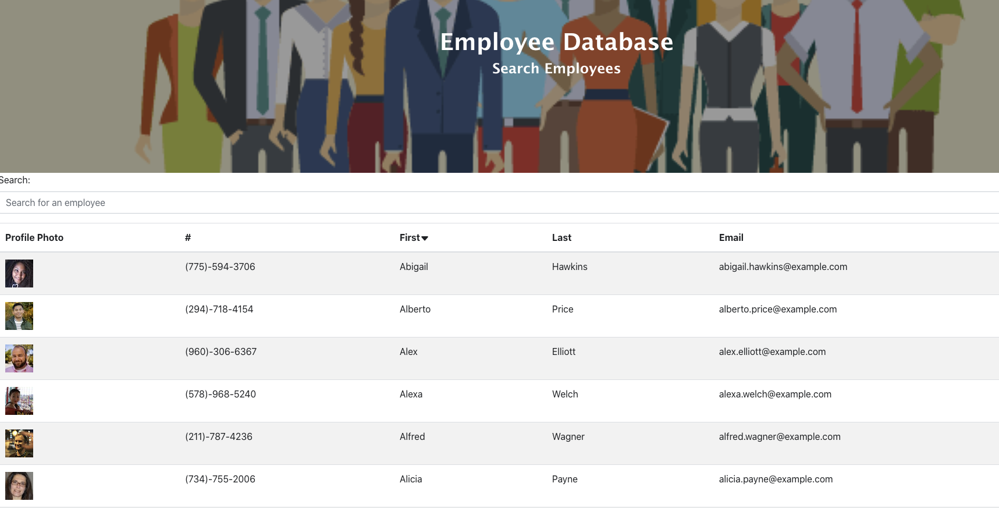

# Employee Directory

## Table of Contents
* [Description](#Description)
* [Installation Instruction](#Installation-Instructions)
* [Usage Information](#Usage-Information)
* [Contributions](#Contributions)
* [Testing](#Testing)
* [Questions?](#Questions?)
## Description
This is a react app that allows you to sort through and filter through a database of employees. You can sort by first name, search by first and last name.
## Installation Instructions
You can download all the necessary files, run an npm i, and run npm run start; or you can simply use the deployed github pages link.
## Usage Information
This app was created using React. 
## Contributions
Much thanks to Elijah Flanders for working on this project with me as well as Brooklynne Audette (https://github.com/B-Audette) for all of her help.
## Testing
N/A
## Questions?
Contact the author for further inquiries! 
Deployed link:  
Github link: (https://github.com/kyliemegan24) 
Email: kyliemegan24@gmail.com